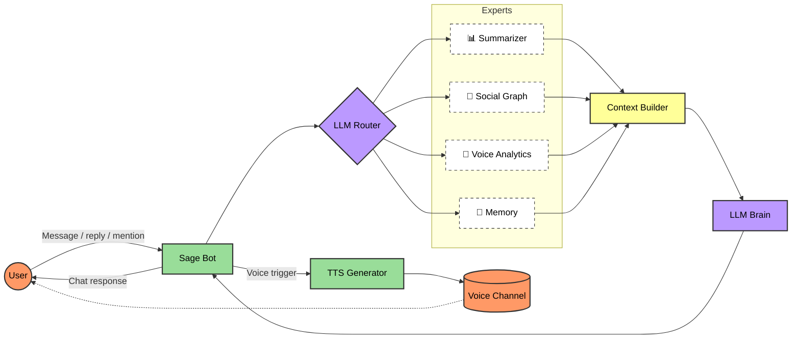

<p align="center">
  
</p>

<h1 align="center">Sage</h1>
<h3 align="center">Fully Agentic Intelligence for Discord</h3>

<p align="center">
  <a href="https://pollinations.ai"></a>
  <a href="LICENSE"></a>
  <a href="https://github.com/BokX1/Sage/actions/workflows/ci.yml"></a>
  
</p>

<p align="center">
  <strong>Sage is a self-learning AI companion that grows with your community, observes social vibes, and delivers intelligent, context-aware responses.</strong>
</p>

<p align="center">
  <strong>🎮 <a href="docs/QUICKSTART.md">I just want to run the bot</a></strong> · <strong>💻 <a href="#-developer-quick-start">I'm a developer</a></strong>
</p>

---

## 🧭 Quick navigation

- [🎯 What is Sage?](#what-is-sage)
- [🏛️ High-Level Architecture](#high-level-architecture)
- [✨ Features](#features)
- [🚀 Getting Started](#getting-started)
- [💻 Developer Quick Start](#developer-quick-start)
- [🛠️ Configuration](#configuration)
- [📚 Documentation](#documentation)
- [💚 Why Choose Sage?](#why-choose-sage)

---

## 🎯 What is Sage?

Sage is a **fully agentic Discord companion** that goes beyond simple chat commands. Unlike traditional bots, Sage is designed to be a friendly member of your community who **listens and evolves alongside you**:

- 🧠 **Self-Learning Memory**: Remembers past conversations to build personalized user contexts.
- 👥 **Socially Aware**: Understands relationship tiers (Best Friend, Acquaintance) and interaction "vibes."
- 👁️ **Vision & Image Analysis**: Ingests images to discuss visual content and extract information.
- 📄 **Knowledge Base**: Ingests code files and text documents to provide expert-level analysis.
- 💬 **Intelligent Routing**: Uses a high-precision LLM classifier to resolve pronouns and context.

**Perfect for:** Coding communities • Gaming groups • Research teams • Any Discord that wants a bot that "gets it."

---

## 🏛️ High-Level Architecture



---

## ✨ Features

| Feature | Description |
| :--- | :--- |
| 🧠 **Agentic Memory** | Builds long-term preferences and throttles updates for efficiency |
| 👁️ **Vision Support** | Analyzes and discusses images shared in chat |
| 📄 **File Analysis** | Share `.ts`, `.py`, `.txt` files for instant review or discussion |
| 🎤 **Voice Companion (Beta)** | Text-to-speech companion with dynamic personas (BYOP required) |
| 📊 **Voice Insights** | Tracks presence and duration, translating raw data into natural language |
| 🤝 **Social Graph** | Visualizes relationship tiers and interaction patterns with emojis |
| 🚀 **Self-Correcting** | Autonomous tool loop with error recovery for high reliability |
| ⚡ **Powered by Pollinations.ai** | Fast, high-throughput multi-model AI access |

---

## 🚀 Getting Started

### Option A: Use the public bot

1. **Invite Sage**

   [**Click here to invite Sage to your server**](https://discord.com/api/oauth2/authorize?client_id=1211723232808570971&permissions=414464731200&scope=bot%20applications.commands)

2. **Activate BYOP (recommended for higher limits)**

   - Run `/sage key login` to get your Pollinations key.
   - Run `/sage key set <your_key>` to activate Sage for the entire server.

> [!TIP]
> Prefer least-privilege permissions? Generate a custom invite URL in the Discord Developer Portal (see [Getting Started → Invite Bot](docs/GETTING_STARTED.md#step-6-invite-sage-to-your-server)).

### Option B: Self-host from source

Follow **[📖 Getting Started](docs/GETTING_STARTED.md)** for a full walkthrough (Node.js, Docker/Postgres, onboarding wizard, and invite generation).

---

## 💻 Developer Quick Start

> [!NOTE]
> This is a fast path. For a complete setup (including creating a Discord app), use [Getting Started](docs/GETTING_STARTED.md).

```bash
git clone https://github.com/BokX1/Sage.git
cd Sage
npm install
npm run onboard
docker compose -f config/ci/docker-compose.yml up -d db
npm run db:migrate
npm run dev
```

When Sage starts, you should see:

```text
[info] Logged in as Sage#1234
[info] Ready!
```

---

## 🛠️ Configuration

Sage is optimized for community interaction out of the box.

```env
# behavior
AUTOPILOT_MODE=manual      # Recommended for stability
PROFILE_UPDATE_INTERVAL=5  # Update user knowledge every 5 messages
TRACE_ENABLED=true         # enable observability for admins
```

See [Configuration Reference](docs/CONFIGURATION.md) for full details.

---

## 📚 Documentation

| Document | Description |
| :--- | :--- |
| [📚 Documentation Hub](docs/README.md) | **Start here** — Complete navigation index |
| [⚡ Quick Start](docs/QUICKSTART.md) | 5-minute setup for new users |
| [📖 Getting Started](docs/GETTING_STARTED.md) | Complete beginner walkthrough |
| [🎮 Commands](docs/COMMANDS.md) | Full slash command reference |
| [❓ FAQ](docs/FAQ.md) | Frequently asked questions |
| [🔧 Troubleshooting](docs/TROUBLESHOOTING.md) | Error resolution guide |
| [⚙️ Configuration](docs/CONFIGURATION.md) | All settings explained |
| [🤖 Agentic Architecture](docs/AGENTIC_ARCHITECTURE.md) | What makes Sage different |
| [🏗️ Architecture](docs/architecture/) | Technical deep-dives |
| [🔒 Security & Privacy](docs/security_privacy.md) | Data handling and privacy |
| [🐝 Pollinations](docs/POLLINATIONS.md) | AI provider details |
| [📋 Operations](docs/operations/runbook.md) | Deployment guide |

---

## 💚 Why Choose Sage?

| Feature | Traditional Bots | Sage |
| :--- | :--- | :--- |
| **Memory** | Forgets after each message | Remembers and learns over time |
| **Social Awareness** | Treats all users the same | Understands relationships and vibes |
| **Context** | Limited to current message | Full conversation + user history |
| **Error Recovery** | Fails silently | Self-corrects with retry loops |
| **Adaptation** | Static responses | Evolves with your community |

[Learn more about Sage's Agentic Architecture →](docs/AGENTIC_ARCHITECTURE.md)
