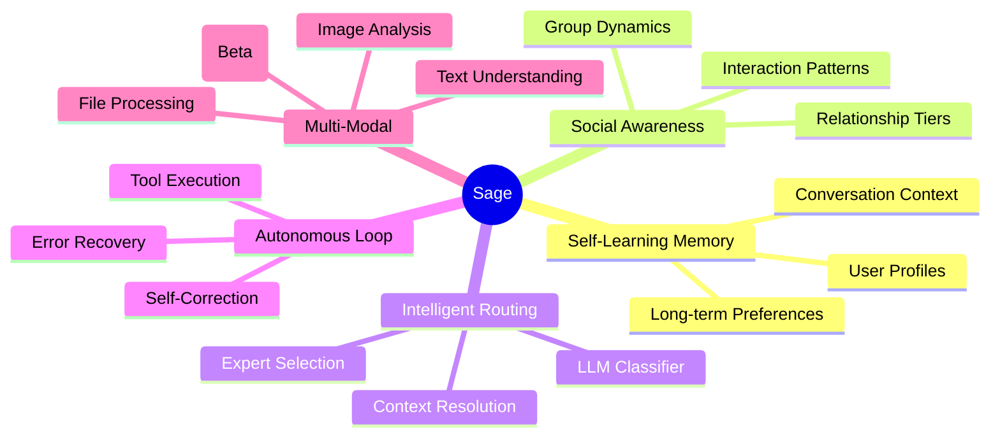
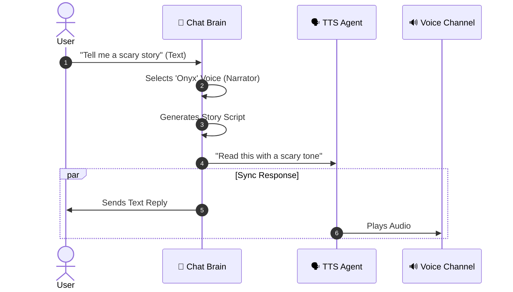
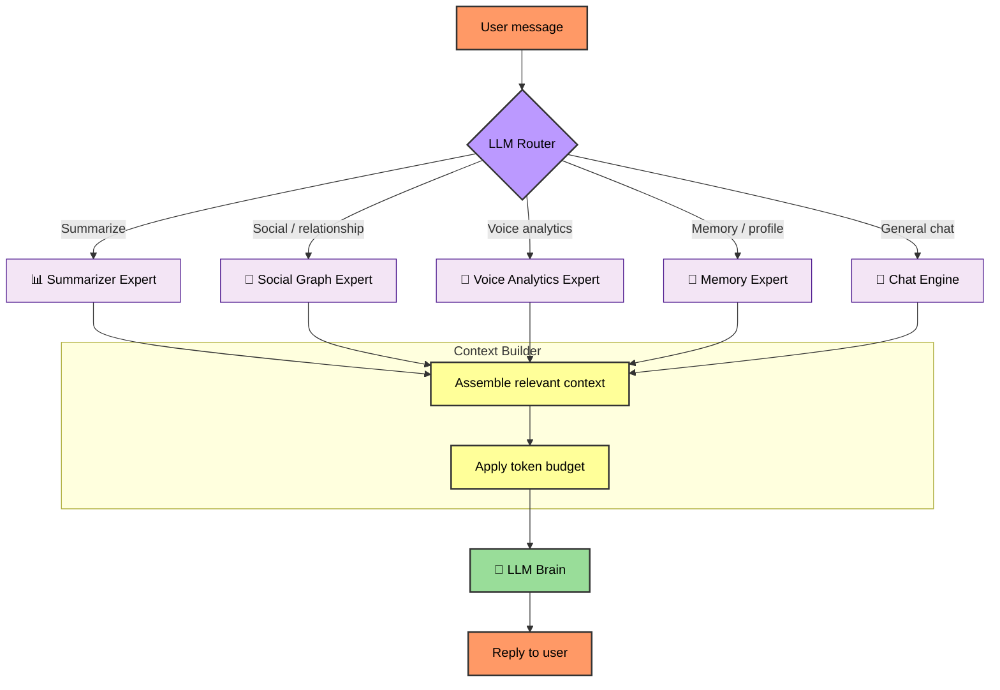
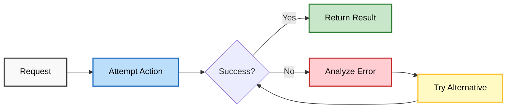
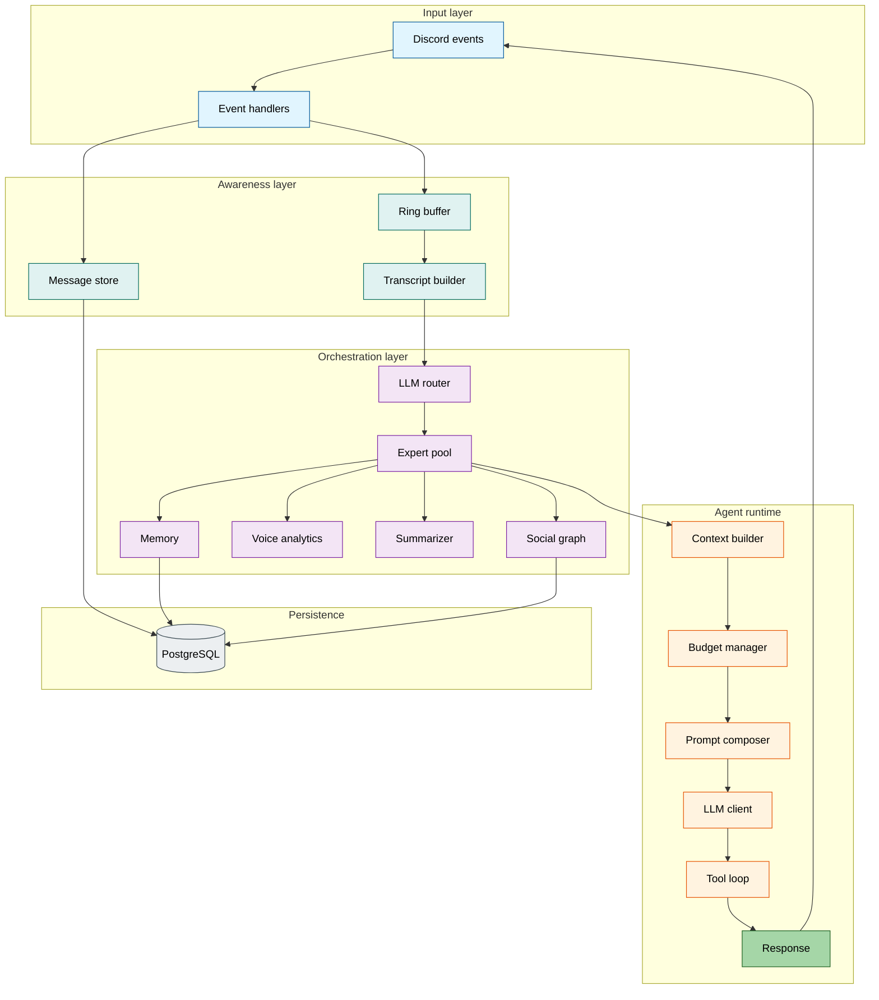

# 🤖 Agentic Architecture

<p align="center">
  
  
</p>

**Sage is not just a chatbot — it’s a fully agentic Discord companion that thinks, learns, and adapts.**

This document explains what makes Sage different from traditional bots and how its agentic architecture works.

---

## 🧭 On this page

- [What is “agentic AI”?](#-what-is-agentic-ai)
- [The five pillars](#-the-five-pillars-of-sages-intelligence)
- [How Sage learns](#-how-sage-learns)
- [Social intelligence](#-social-intelligence)
- [Voice companion (beta)](#-voice-companion-beta)
- [Routing and experts](#-intelligent-routing)
- [Self-correcting tool loop](#-self-correcting-agent-loop)
- [Observability](#-observability)
- [Technical architecture map](#-technical-architecture)

---

## 🎯 What is "Agentic AI"?

An **agentic AI** is an AI system that can:

| Capability | Traditional Bot | Agentic Bot (Sage) |
| :--- | :--- | :--- |
| **Memory** | Forgets after each message | Remembers and learns over time |
| **Autonomy** | Only responds to commands | Can observe, think, and act proactively |
| **Context** | Limited to current message | Understands conversation history and relationships |
| **Adaptation** | Static responses | Evolves understanding of each user |
| **Error Recovery** | Crashes or fails silently | Self-corrects and tries alternative approaches |

---

## 🧠 The Five Pillars of Sage's Intelligence



---

## 🆚 Sage vs Traditional Bots

### Scenario: A user frequently talks about TypeScript

| Aspect | Traditional Bot | Sage |
| :--- | :--- | :--- |
| **Day 1** | "What is TypeScript?" → Generic explanation | Same → Generic explanation |
| **Day 7** | Same question → Same generic answer | Notices pattern, asks: "Working on your TypeScript project again?" |
| **Day 30** | No memory of past help | Remembers preferences, code style, common issues |
| **Relationship** | All users treated identically | "Best Friend" status = more personalized help |

### Scenario: User asks "Can you help with that thing?"

| Traditional Bot | Sage |
| :--- | :--- |
| ❌ "I don't understand what 'that thing' means" | ✅ Checks recent context: "You mean the API rate limiting issue we discussed earlier?" |
| ❌ "I cannot see images" | ✅ Analyzes shared images: "I see a React component in that screenshot—want me to debug it?" |

---

## 🔄 How Sage Learns

```mermaid
sequenceDiagram
    autonumber
    participant User
    participant Sage
    participant Memory
    participant Profile

    User->>Sage: Message
    Sage->>Memory: Fetch recent context
    Memory-->>Sage: Last 15 messages + user profile

    Sage->>Sage: Generate response with full context
    Sage->>User: Personalized reply

    rect rgb(45, 45, 45)
        Note over Sage,Profile: Asynchronous Learning Loop (Every 5 messages)
        Sage->>Profile: Update user profile
        Profile->>Profile: Consolidate facts
        Profile->>Profile: Detect intent patterns
        Profile-->>Memory: Save updated profile
    end
```



### What Sage Remembers

| Category | Examples |
| :--- | :--- |
| **Preferences** | Favorite programming languages, preferred explanations style |
| **Context** | Current projects, recent discussions, ongoing problems |
| **Relationships** | Who talks to whom, interaction frequency, closeness |
| **Patterns** | Common questions, active hours, communication style |

### What Sage Forgets

| Category | Reason |
| :--- | :--- |
| **Raw messages** | Summarized into profiles (privacy by design) |
| **Sensitive data** | Never stored in profiles |
| **Old context** | Replaced with consolidated summaries |

---

## 🎭 Social Intelligence

Sage understands **who you are** to each other.

### Relationship Tiers

```text
👑 Best Friend (0.9+)
   └─ Very personalized, remembers everything

💚 Close Friend (0.7-0.9)
   └─ Warm and familiar, good context

🤝 Friend (0.5-0.7)
   └─ Friendly, growing understanding

👋 Acquaintance (0.3-0.5)
   └─ Polite, learning about you

👤 Stranger (<0.3)
   └─ New friend, neutral and helpful
```

### How Relationships Form

Sage builds relationships naturally through:

- **Message interactions** — Replies, mentions, conversations
- **Voice presence** — Time spent together in voice channels
- **Shared activities** — Group discussions, collaborative problem-solving

> [!TIP]
> Use `/sage whoiswho` to see your relationship status.

---

## 🎤 Voice Companion (Beta)

Sage introduces a **"Text-in, Voice-out"** architecture for a seamless voice experience.

### Decoupled Intelligence

Unlike traditional voice bots that struggle with speech-to-text accuracy, Sage decouples the "Brain" from the "Mouth".

1. **The Brain (Chat Agent):** You type to Sage in text. This uses Sage’s memory, tools, and social context without degradation.
2. **The Mouth (TTS Agent):** Sage replies in text *and* simultaneously speaks the response in your voice channel.

### Dynamic Persona

Sage analyzes conversation style and intent to dynamically select a voice persona (e.g., “Deep Narrator”, “Energetic Friend”) and instructs the TTS model accordingly.



---

## 🧭 Intelligent Routing

Sage uses an **LLM-powered router** to understand questions and choose experts.



### Why This Matters

| Query | Traditional Bot | Sage |
| :--- | :--- | :--- |
| "Who was in voice last night?" | ❌ "I can't access voice data" | ✅ Routes to Voice Expert → "Alice, Bob, and Charlie were in General for 2 hours" |
| "Summarize what we talked about" | ❌ "What conversation?" | ✅ Routes to Summarizer → Provides channel summary |
| "What did Sarah say about TypeScript?" | ❌ "I don't know Sarah" | ✅ Routes to Memory → Recalls Sarah's recent TypeScript discussions |

---

## 🔁 Self-Correcting Agent Loop

Sage doesn't just fail — it **adapts**.



### Error Recovery Example

```text
User: "Summarize the #dev channel"

Attempt 1: Query channel summary
  → Error: No recent summary exists

Attempt 2: Trigger on-demand summarization
  → Error: Rate limited

Attempt 3: Use channel transcript directly
  → Success: Generates summary from raw messages

Reply: "Here's what happened in #dev today..."
```

---

## 📊 Observability

Admins can inspect how Sage reasoned about a request.

### Trace Viewing

```text
/sage admin trace
```

Shows:

- 🧭 Router decision — which experts were selected and why
- 📦 Context used — what information Sage considered
- 🔧 Tool calls — what actions were attempted
- 💭 Reasoning — how the final response was generated

---

## 🏗️ Technical Architecture



---

## 🎓 Learn More

- [Memory System Deep-Dive](architecture/memory_system.md)
- [Pipeline Architecture](architecture/pipeline.md)
- [Configuration Reference](CONFIGURATION.md)
- [Database Schema](architecture/database.md)

---

<p align="center">
  <em>Sage: The Discord companion that actually <strong>gets it</strong>.</em>
</p>
