# 🌸 Bring Your Own Pollen (BYOP)

Sage uses a community-friendly model: **the bot is free to host, and communities provide the “brain power” (API key).**

This keeps Sage sustainable and enables higher limits for your server.

---

## 🧭 Quick navigation

- [🔑 How It Works](#how-it-works)
- [🚀 Setup Guide (For Admins)](#setup-guide-for-admins)
- [🔐 Key Safety Notes](#key-safety-notes)
- [❓ FAQ](#faq)

---

<a id="how-it-works"></a>

## 🔑 How It Works

Sage needs an API key (“Pollen”) to generate responses. This can be provided in two ways:

1. **Server-wide key (BYOP)**: **(Standard)** A server admin sets a specific key for their community using `/sage key set`.
2. **Host-level key (`.env`)**: **(Optional)** The bot owner sets a default key for all servers.

This key is used for:

- 💬 Text chat (default)
- 👁️ Vision (image understanding)
- 🎨 Image generation & editing
- 🎤 Voice-related features (where enabled)

### The Activation Lifecycle

```mermaid
flowchart LR
    %% Admin-provided key enables server-wide access (BYOP mode).
    classDef start fill:#dcedc8,stroke:#33691e,stroke-width:2px,color:black
    classDef step fill:#e1f5fe,stroke:#01579b,stroke-width:2px,color:black
    classDef finish fill:#ffccbc,stroke:#bf360c,stroke-width:2px,color:black

    A[Invite Sage]:::start
      --> B["Sage joins server"]:::step
      --> C["/sage key login"]:::step
      --> D["Get key from Pollinations"]:::step
      --> E["/sage key set sk_..."]:::step
      --> F["Sage active for everyone"]:::finish
```



---

<a id="setup-guide-for-admins"></a>

## 🚀 Setup Guide (For Admins)

**Prerequisite:** You must be a Server Admin or have the **Manage Guild** permission.

### Step 1: Get Your Key

Run:

```text
/sage key login
```

Open the link, sign in via Pollinations (GitHub), then copy the key from the URL (starts with `sk_`).

> [!TIP]
> You can also manage/create keys directly from the Pollinations dashboard at `enter.pollinations.ai`.

### Step 2: Activate Sage (server-wide)

Run:

```text
/sage key set <your_key>
```

That’s it — Sage is active for the whole server. 🎉

---

<a id="key-safety-notes"></a>

## 🔐 Key Safety Notes

- The key is **server-wide** and used for requests originating from that server.
- Treat your `sk_...` key like a password.
- If you need to revoke access, run `/sage key clear` and/or rotate the key in Pollinations.

---

<a id="faq"></a>

## ❓ FAQ

**Q: Do my members need to pay?**  
**A:** No. The key you provide covers everyone. Pollinations.ai offers free tiers, so it’s often free for many communities.

**Q: Is this safe?**  
**A:** The key is stored in Sage’s database and is used to make requests on behalf of your server.

**Q: How do I remove a key?**  
**A:** Run `/sage key clear`.

---

<p align="center">
  <sub>Powered by <a href="https://pollinations.ai">Pollinations.ai</a> 🐝</sub>
</p>
