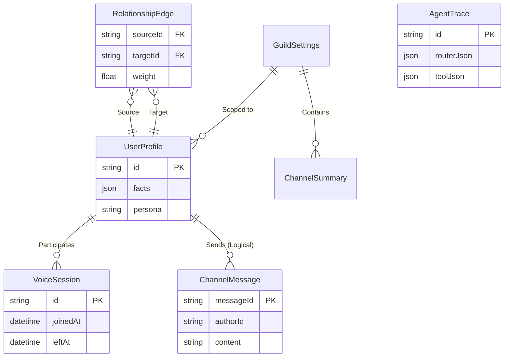

# Sage Database Architecture

Sage uses **PostgreSQL** (via Prisma) to persist its long-term memory, social relationships, and processing traces.

## Entity Relationship Diagram (ERD)

## Core Tables

| Table | Purpose |
| :--- | :--- |
| `UserProfile` | Stores agentic personalities and user preferences. |
| `RelationshipEdge` | Stores social interaction weights and tiers. |
| `AgentTrace` | Stores LLM reasoning and routing decisions for audit. |
| `ChannelSummary` | Stores long-term and rolling conversation recaps. |
| `VoiceSession` | Stores presence history for voice awareness. |
