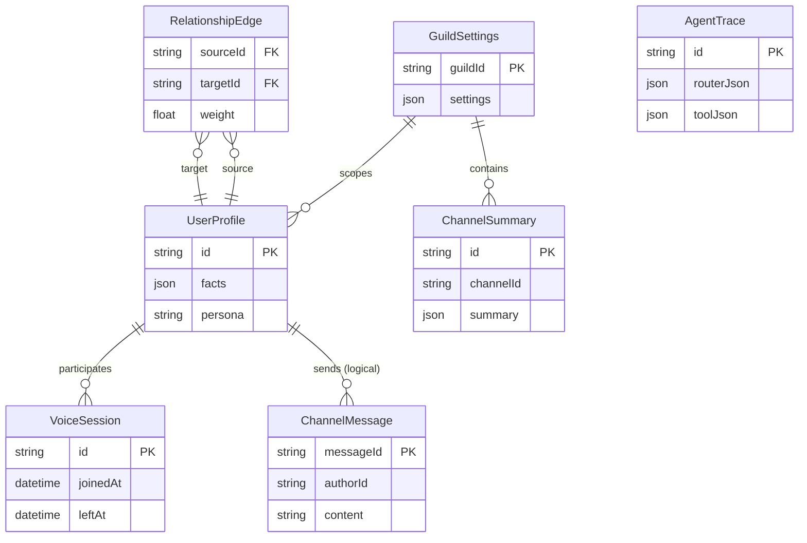

# 💾 Sage Database Architecture

Sage uses **PostgreSQL** (via Prisma) to persist long-term memory, social relationships, and processing traces.

> [!NOTE]
> The ERD below is a simplified overview intended for orientation. The schema in `prisma/schema.prisma` is the authoritative reference.

---

## 🧭 Quick navigation

- [Entity Relationship Diagram (ERD)](#entity-relationship-diagram-erd)
- [Core tables](#core-tables)

---

## Entity Relationship Diagram (ERD)

---

## Core tables

| Table | Purpose |
| :--- | :--- |
| `UserProfile` | Stores agentic personalities and user preferences. |
| `RelationshipEdge` | Stores social interaction weights and tiers. |
| `AgentTrace` | Stores LLM reasoning and routing decisions for audit. |
| `ChannelSummary` | Stores long-term and rolling conversation recaps. |
| `VoiceSession` | Stores presence history for voice awareness. |
