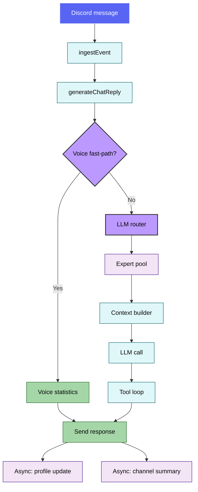

# 🔀 Sage Runtime Pipeline (Routing + Orchestration)

This document explains how Sage routes incoming messages, builds context, and executes LLM calls. It reflects the current implementation in `src/core/agentRuntime` and `src/core/orchestration`.

---

## 🧭 Quick navigation

- [1) High-level flow](#1-high-level-flow)
- [2) Intelligent LLM Router](#2-intelligent-llm-router)
- [3) Narrative experts](#3-narrative-experts)
- [4) Agentic tool loop & error recovery](#4-agentic-tool-loop-error-recovery)
- [5) Context building](#5-context-building)
- [6) Tracing & observability](#6-tracing-observability)
- [7) Voice fast-path](#7-voice-fast-path)
- [🔗 Related documentation](#related-documentation)

---

## 1) High-level flow



---

## 2) Intelligent LLM Router

**File:** `src/core/orchestration/llmRouter.ts`

Sage uses a **high-precision LLM classifier** (via `gemini-fast` / Gemini 2.5 Flash Lite) to decide what kind of request a message represents and which experts should run.

Key properties:

- **Contextual intelligence:** The router receives the **last 7 messages** of history, helping it resolve pronouns (e.g., “what about them?”).
- **Structured output:** Returns JSON containing `kind` (route), `reasoningText` (why), and `experts` to invoke.
- **Fail-safe:** If routing fails or JSON is invalid, Sage defaults to `chat` with basic memory support.

| Route | Primary purpose | Default experts |
| --- | --- | --- |
| `summarize` | “summarize / recap / what happened” | Summarizer, Memory |
| `voice_analytics` | “who’s in voice / how long in voice” | VoiceAnalytics, Memory |
| `social_graph` | “relationship / social graph / who knows whom” | SocialGraph, Memory |
| `memory` | “what do you know about me” | Memory |
| `admin` | Slash command context or “admin/config” | SocialGraph, VoiceAnalytics, Memory |
| `qa` | General conversation / default | Memory |

---

## 3) Narrative experts

**File:** `src/core/orchestration/runExperts.ts`

Experts run secondary DB lookups and return **enriched narrative packets** for the LLM:

- **Memory** → User profile summary
- **Summarizer** → Latest rolling channel summary
- **VoiceAnalytics** → Human-readable session data (e.g., “Active for 2 hours and 15 minutes”)
- **SocialGraph** → Relationship tiers (e.g., “Best Friend 🌟”) and interaction counts

These packets are injected into the system prompt so the model has structured context before responding.

---

## 4) Agentic tool loop & error recovery

**File:** `src/core/agentRuntime/toolCallLoop.ts`

Sage implements a self-correcting tool loop:

1. **Execution:** The LLM calls a tool (e.g., `google_search`).
2. **Error classification:** Tool errors are categorized (e.g., `timeout`, `validation_error`).
3. **Internal feedback:** Sage returns a structured suggestion back to the LLM.
4. **Autonomous retry:** The agent can retry with corrected parameters, try an alternative tool, or explain failure.

### Tool loop sequence

```mermaid
sequenceDiagram
    participant Brain as LLM Brain
    participant Loop as Tool Loop
    participant Exec as Tool Execution

    Brain->>Loop: Tool call envelope (e.g., Search: "query")
    Loop->>Exec: Execute (with timeout)

    alt Success
        Exec-->>Loop: Results
        Loop-->>Brain: ✅ Tool result
    else Error (timeout/validation)
        Exec-->>Loop: Error
        Loop->>Loop: Classify + suggest fix
        Loop-->>Brain: ❌ Error + retry hint
        Note over Brain: Brain adjusts query/params
        Brain->>Loop: Retry tool call
    end

    Loop-->>Brain: Updated context
    Brain-->>Brain: Continue reasoning
```

---

## 5) Context building

**File:** `src/core/agentRuntime/contextBuilder.ts`

The context builder composes a single system message with:

- Core system prompt + user/channel profiles
- Narrative expert packets
- Relationship hints + rolling summary
- Transcript block (respecting token budgets)

It uses `contextBudgeter` to respect limits defined in `src/config.ts`.

---

## 6) Tracing & observability

**File:** `src/core/trace/agentTraceRepo.ts`

Every interaction can be traced for admin debugging:

- **Reasoning:** Router `reasoningText` stored in `AgentTrace`
- **Payloads:** Expert packets, tool calls, and final responses
- **Access:** surfaced via `/sage admin trace`

---

## 7) Voice fast-path

Before invoking the full LLM pipeline, Sage uses a deterministic fast-path for simple voice queries (e.g., “who is in voice?”). This enables sub-second responses using `src/core/voice/voiceQueries.ts`.

---

## 🔗 Related documentation

- [🧠 Memory system](memory_system.md)
- [💾 Database architecture](database.md)
- [🤖 Agentic architecture](../AGENTIC_ARCHITECTURE.md)
