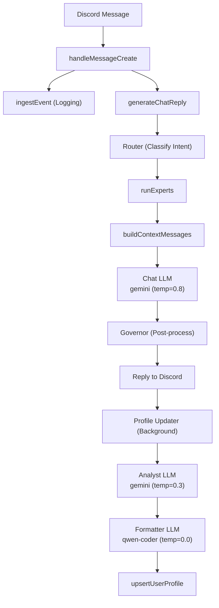

# Sage Memory Arc: Technical Architecture 🧠🔥

This document outlines the **"Split-Brain" Pipeline** used by Sage to achieve both instant conversational responses (Foreground) and deep, long-term memory persistence (Background).

---

## ⚡ The Pipeline Overview



**0. THE TRIGGER**

* **Source:** User sends a Discord message.
* **Entry Point:** `src/bot/handlers/messageCreate.ts` (`handleMessageCreate`)
* **Action:**
    1. **Ingest:** Logs event to storage via `ingestEvent` (Side-effect).
    2. **Orchestrate:** Calls `generateChatReply` in `src/core/chat/chatEngine.ts`.
* **Flow:** The process splits. The **Conversation Track** blocks for a reply, while the **Memory Track** is triggered asynchronously after the reply is generated.

---

## 🟢 TRACK A: The Conversation (Foreground)

* **Goal:** Instant gratification & intelligent response.
* **Component:** `ChatEngine` (`src/core/chat/chatEngine.ts`) → `AgentRuntime` (`src/core/agentRuntime/agentRuntime.ts`)

### Step 1: Router Classification (D9 MoE)

* **Action:** `decideRoute()` in `src/core/orchestration/router.ts` classifies user intent.
* **Outputs:**
  * `RouteKind`: `summarize`, `qa`, `admin`, `voice_analytics`, `social_graph`, `memory`
  * `ExpertName[]`: Which experts to query for context
  * `temperature`: Route-specific temperature (default 0.8 for chat)
  * `allowTools`: Whether to enable tool calls

### Step 2: Expert Queries

* **Action:** `runExperts()` in `src/core/orchestration/runExperts.ts` performs cheap DB lookups.
* **Experts Available:** `Memory`, `Summarizer`, `VoiceAnalytics`, `SocialGraph`
* **Output:** Expert packets injected into context.

### Step 3: Context Loading (Working Memory)

* **Action:** `contextBuilder.ts` assembles a priority-based context window.
* **Inputs:**
  * **User Profile:** Long-term facts about the specific user (`userProfileRepo.ts`).
  * **Channel Profile:** Long-term "vibe" and history of the channel.
  * **Rolling Summary:** Short-term summary of the last ~2 hours/120 messages.
  * **Relationship Hints:** Social graph data (Who knows whom).
  * **Expert Packets:** Route-specific context from D9 experts.
  * **Transcript:** Recent raw messages (up to 80 messages / 24,000 chars).
* **Status:** 📖 Context Retrieved.

### Step 4: Generation (Agent Runtime)

* **Action:** Sends User Message + Assembled Context + System Prompt to the **Chat LLM**.
* **Provider:** Pollinations
* **Model:** `gemini-large`
* **Temperature:** `0.8` ✅ Implemented
* **Output:** The LLM generates a conversational reply.

### Step 5: Governor Post-Processing

* **Action:** `governOutput()` in `src/core/orchestration/governor.ts` validates and sanitizes the response.
* **Features:** Safety checks, optional rewrite.
* **Note:** Banned phrase guardrail has been removed for cleaner responses.

### Step 6: Delivery

* **Action:** Bot sends the final text response to the Discord channel.
* **Status:** ✅ User received reply.

---

## 🔵 TRACK B: The Memory Core (Background)

* **Goal:** Long-term memory consolidation & High-Fidelity Analysis.
* **Components:** `ProfileUpdater` (User) & `ChannelSummaryScheduler` (Channel).

### B1. User Memory (Personalization)

* **Trigger:** Called immediately after Track A generates the reply (fire-and-forget).
* **File:** `src/core/memory/profileUpdater.ts`
* **Architecture:** Two-step pipeline where the Analyst does all the work.

#### Step 1: The Analyst (gemini-large) — Memory Updater

* **Input:** `Previous Summary` + `User Message` + `Assistant Reply`.
* **Task:** Read previous summary, analyze new interaction, output **the updated summary**.
* **Role:** Merge existing facts with new stable facts. PRESERVE all previous facts unless contradicted.
* **Model:** `gemini-large`
* **Temperature:** `0.3` (creative but focused)
* **Output:** **The updated summary text directly** — NOT an analysis, but the actual summary to save.
* **Example:** Previous: "Lives in Paris." → After learning user likes cats → Output: "Lives in Paris. Loves cats."

> [!IMPORTANT]
> If nothing new is learned, the Analyst outputs the **previous summary unchanged** to preserve memory.

#### Step 2: The Formatter (qwen-coder) — JSON Wrapper

* **Input:** Analyst's output text (the updated summary).
* **Instruction:** "Wrap this text in JSON."
* **Role:** Pure text-to-JSON wrapper. **Does NOT interpret, extract, or modify.**
* **Model:** `qwen-coder`
* **Temperature:** `0.0` (deterministic)
* **Output:** `{"summary": "<exact text from analyst>"}`

> [!CAUTION]
> The Formatter must NOT "take key points" or rewrite — that would cause memory regression.

#### Step 3: The Gatekeeper (Validation & Commit)

* **Action:** `extractBalancedJson` -> `JSON.parse` -> `upsertUserProfile`.
* **Fallback:** If formatter fails, **previous summary is preserved** (not lost).
* **Status:** ✅ User Profile Updated.

### B2. Channel Memory (STM & LTM)

* **Trigger:** `ChannelSummaryScheduler` runs every tick (e.g., 60s) looking for "dirty" channels.
* **File:** `src/core/summary/summarizeChannelWindow.ts`
* **Architecture:** Two-step pipeline (same as User Profile)

#### STM: Rolling Summary (Short-Term Memory)

**Step 1: STM Analyst (gemini-large, temp=0.3)**

* **Input:** Last ~120 raw messages.
* **Task:** Summarize recent conversation as free text.
* **Output:** Natural summary paragraphs (topics, threads, unresolved items).

**Step 2: STM Formatter (qwen-coder, temp=0.0)**

* **Input:** Analyst's text.
* **Task:** Wrap in structured JSON.
* **Output:** `{summaryText, topics[], threads[], unresolved[], glossary{}}`

* **Storage:** `ChannelSummary` table (`kind = 'rolling'`).

#### LTM: Channel Profile (Long-Term Memory)

**Step 1: LTM Analyst (gemini-large, temp=0.3)**

* **Input:** Previous Profile + Latest Rolling Summary.
* **Task:** Merge rolling summary into long-term profile.
* **Output:** Updated profile text (preserves existing, adds new).

**Step 2: LTM Formatter (qwen-coder, temp=0.0)**

* **Input:** Analyst's text.
* **Task:** Wrap in structured JSON.
* **Output:** `{summaryText, topics[], threads[], unresolved[], glossary{}}`

* **Storage:** `ChannelSummary` table (`kind = 'profile'`).
* **Fallback:** On failure, previous profile is preserved.

---

## 🛠 Component Mapping

| Role | Model | Temperature | File |
| :--- | :--- | :---: | :--- |
| **Chat LLM** | `gemini` | `0.8` | `router.ts` (default route) |
| **User Profile Analyst** | `gemini-large` | `0.3` | `profileUpdater.ts` |
| **Channel Summary Analyst** | `gemini-large` | `0.3` | `summarizeChannelWindow.ts` |
| **Formatter (all)** | `qwen-coder` | `0.0` | Both updaters |

---

## 🔑 Key Configuration

### Models (Case-Sensitive!)

| Component | Model Name | Config Variable |
| :--- | :--- | :--- |
| **Chat** | `gemini` | `POLLINATIONS_MODEL` |
| **Analyst** | `gemini-large` | `PROFILE_POLLINATIONS_MODEL` |
| **Formatter** | `qwen-coder` | `FORMATTER_MODEL` |
| **Summary Analyst** | `gemini` | `SUMMARY_MODEL` |

### Token Budgets (Generous Defaults)

| Config Variable | Value | Description |
| :--- | ---: | :--- |
| `CONTEXT_MAX_INPUT_TOKENS` | 16,000 | Max input tokens for context |
| `CONTEXT_RESERVED_OUTPUT_TOKENS` | 2,400 | Reserved for LLM output |
| `SYSTEM_PROMPT_MAX_TOKENS` | 3,000 | Max system prompt size |
| `CONTEXT_BLOCK_MAX_TOKENS_TRANSCRIPT` | 4,000 | Max transcript tokens |
| `CONTEXT_BLOCK_MAX_TOKENS_ROLLING_SUMMARY` | 2,400 | Rolling summary budget |
| `CONTEXT_BLOCK_MAX_TOKENS_PROFILE_SUMMARY` | 2,400 | Profile summary budget |
| `CONTEXT_BLOCK_MAX_TOKENS_MEMORY` | 3,000 | Memory context budget |
| `CONTEXT_BLOCK_MAX_TOKENS_REPLY_CONTEXT` | 1,600 | Reply context budget |
| `CONTEXT_USER_MAX_TOKENS` | 5,000 | User message budget |
| `CONTEXT_BLOCK_MAX_TOKENS_EXPERTS` | 2,400 | Expert packets budget |
| `CONTEXT_BLOCK_MAX_TOKENS_RELATIONSHIP_HINTS` | 1,200 | Relationship hints budget |
| `CONTEXT_TRANSCRIPT_MAX_MESSAGES` | 80 | Max messages in transcript |
| `CONTEXT_TRANSCRIPT_MAX_CHARS` | 24,000 | Max chars in transcript |

### Environment Variables

| Variable | Purpose | Default |
| :--- | :--- | :--- |
| `LLM_PROVIDER` | Powers all LLM calls | `pollinations` |
| `POLLINATIONS_MODEL` | Default chat model | `gemini-large` |
| `PROFILE_PROVIDER` | Profile LLM provider override | *empty* (uses default) |
| `PROFILE_POLLINATIONS_MODEL` | Analyst model | `gemini` |
| `FORMATTER_MODEL` | Formatter model | `qwen-coder` |
| `SUMMARY_PROVIDER` | Summary LLM provider override | *empty* (uses default) |
| `SUMMARY_MODEL` | Summary model | `gemini` |

---

## ✅ Implementation Status

### Completed Changes

* [x] **Removed banned phrase guardrail** - `chatEngine.ts` simplified
* [x] **Chat temperature set to 0.8** - `router.ts` default QA route
* [x] **Analyst temperature set to 0.3** - `profileUpdater.ts` tryChat
* [x] **Formatter temperature set to 0.0** - `profileUpdater.ts` tryRepairPass
* [x] **Model: Chat = gemini** - `config.ts` POLLINATIONS_MODEL
* [x] **Model: Analyst = gemini** - `config.ts` PROFILE_POLLINATIONS_MODEL
* [x] **Model: Formatter = qwen-coder** - `config.ts` FORMATTER_MODEL
* [x] **Token budgets doubled** - All context budgets generously increased

---

## 📊 Flow Diagram (Detailed)

```
┌─────────────────────────────────────────────────────────────────────┐
│                        USER MESSAGE                                  │
└────────────────────────────┬────────────────────────────────────────┘
                             │
                             ▼
┌─────────────────────────────────────────────────────────────────────┐
│ messageCreate.ts                                                     │
│ ├─ Dedupe check                                                     │
│ ├─ Bot-author filter                                                │
│ ├─ ingestEvent() → Logs to DB                                       │
│ └─ generateChatReply() ─────────────────────────────────────────────┤
└────────────────────────────┬────────────────────────────────────────┘
                             │
              ┌──────────────┴──────────────┐
              │                             │
              ▼                             ▼
┌──────────────────────────┐  ┌──────────────────────────────────────┐
│ TRACK A: FOREGROUND      │  │ TRACK B: BACKGROUND                  │
│ (Blocking - Reply)       │  │ (Async - Memory)                     │
├──────────────────────────┤  ├──────────────────────────────────────┤
│ 1. Router Classification │  │ Triggered AFTER reply sent:          │
│    └─ decideRoute()      │  │                                      │
│ 2. Expert Queries        │  │ B1. User Profile Update:             │
│    └─ runExperts()       │  │     ├─ Analyst (gemini, 0.3)         │
│ 3. Context Loading       │  │     └─ Formatter (qwen-coder, 0.0)   │
│    └─ buildContext()     │  │                                      │
│ 4. LLM Generation        │  │     └─ gemini, 0.3         │
│    └─ gemini, 0.8        │  │     └─ Formatter (qwen-coder, 0.0)   │
│ 5. Governor Post-proc    │  │     └─ Profile (every 6h)            │
│ 6. Reply to Discord      │  │                                      │
└──────────────────────────┘  └──────────────────────────────────────┘
```

---

## 🔧 Files Modified

| File | Changes |
| :--- | :--- |
| `src/config.ts` | Token budgets increased, models updated to gemini-large/qwen-coder |
| `src/core/config/env.ts` | Added formatterModel to compatibility layer |
| `src/core/chat/chatEngine.ts` | Removed banned phrase guardrail |
| `src/core/orchestration/router.ts` | Default temperature set to 0.8 |
| `src/core/memory/profileUpdater.ts` | Analyst temp=0.3, Formatter temp=0.0, separate formatter client |
