# 🔀 Sage Runtime Pipeline (Routing + Orchestration)

This document explains how Sage routes incoming messages, builds context, and executes LLM calls. It reflects the current implementation in `src/core/agentRuntime` and `src/core/orchestration`.

---

## 🧭 Quick navigation

- [1) High-level flow](#1-high-level-flow)
- [2) Intelligent LLM Router](#2-intelligent-llm-router)
- [3) Narrative experts](#3-narrative-experts)
- [4) Agentic tool loop & error recovery](#4-agentic-tool-loop-error-recovery)
- [5) Context building](#5-context-building)
- [6) Tracing & observability](#6-tracing-observability)
- [7) Voice fast-path](#7-voice-fast-path)
- [🔗 Related documentation](#related-documentation)

---

<a id="1-high-level-flow"></a>

## 1) High-level flow

```mermaid
flowchart TD
    %% End-to-end message handling (routing + orchestration).
    classDef discord fill:#5865F2,stroke:#fff,color:white
    classDef core fill:#e0f7fa,stroke:#006064,color:black
    classDef router fill:#b9f,stroke:#333,stroke-width:2px,color:black
    classDef expert fill:#f3e5f5,stroke:#4a148c,color:black
    classDef output fill:#a5d6a7,stroke:#1b5e20,color:black

    A[Discord message]:::discord --> B[ingestEvent]:::core --> C[generateChatReply]:::core
    C --> D{Voice fast-path?}:::router

    D -- Yes --> E[Voice statistics]:::output --> K["Send response\n(text + optional attachments)"]:::output

    D -- No --> R[LLM router]:::router
    R --> X[Expert pool\n(Memory / Social / Voice / Summary / Image)]:::expert --> H[Context builder]:::core --> I[LLM call]:::core --> J[Tool loop (qa/admin)]:::core --> K

    K --> L[Async: profile update]:::expert
    K --> M[Async: channel summary]:::expert
```

> [!IMPORTANT]
> On the public bot, **BYOP is required inside servers**. If a message originates from a guild and no server key is set, Sage returns the BYOP welcome message and does not call the LLM.

---

<a id="2-intelligent-llm-router"></a>

## 2) Intelligent LLM Router

**File:** `src/core/orchestration/llmRouter.ts`

Sage uses a **high-precision LLM classifier** (model alias `gemini-fast`) to decide what kind of request a message represents and which experts should run.

Key properties:

- **Contextual intelligence:** The router receives the **last 7 messages** of history, helping it resolve pronouns (e.g., “what about them?”).
- **Structured output:** The router returns JSON (route + experts). `decideRoute()` validates it and produces a `RouteDecision` (`kind`, `experts`, `allowTools`, `temperature`, `reasoningText`).
- **Fail-safe:** If routing fails or JSON is invalid, Sage defaults to `qa` (with the Memory expert enabled).

| Route | Primary purpose | Typical experts (router prompt) |
| :--- | :--- | :--- |
| `summarize` | Channel recap / TL;DR | Summarizer, Memory |
| `qa` | Default conversation + Q&A (fallback) | *(router decides; often includes Memory)* |
| `image_generate` | Generate or edit an image | ImageGenerator *(Memory may be included)* |
| `voice_analytics` | Voice analytics / voice-mode hints | VoiceAnalytics, Memory |
| `social_graph` | Relationship / connection reasoning | SocialGraph, Memory |
| `memory` | Profile / “remember/forget” intents | Memory |
| `admin` | Slash commands / configuration | SocialGraph, VoiceAnalytics, Memory *(tools enabled)* |

> [!NOTE]
> Sage validates router output against: `summarize`, `qa`, `admin`, `voice_analytics`, `social_graph`, `memory`, `image_generate`.
> If the router returns an empty expert list, Sage injects `Memory` as a safe default.

---

<a id="3-narrative-experts"></a>

## 3) Narrative experts

**File:** `src/core/orchestration/runExperts.ts`

Experts run secondary lookups (usually DB, sometimes external calls) and return **enriched packets** for the LLM (and optionally files):

- **Memory** → User profile summary
- **Summarizer** → Latest rolling channel summary
- **VoiceAnalytics** → Human-readable session data (e.g., “Active for 2 hours and 15 minutes”)
- **SocialGraph** → Relationship tiers (e.g., “Best Friend 🌟”) and interaction counts
- **ImageGenerator** → Refines your prompt and fetches image bytes from Pollinations (`/image/{prompt}`); can also do image-to-image edits when you attach/reply to an image

These packets are injected into the system prompt so the model has structured context before responding.

> [!NOTE]
> Experts can also return **binary attachments** (currently used for image generation). Attachments are sent alongside the first Discord reply chunk.

---

<a id="4-agentic-tool-loop-error-recovery"></a>

## 4) Agentic tool loop & error recovery

**File:** `src/core/agentRuntime/toolCallLoop.ts`

Sage implements a self-correcting tool loop:

1. **Execution:** The LLM calls a tool (e.g., `google_search`).
2. **Error classification:** Tool errors are categorized (e.g., `timeout`, `validation_error`).
3. **Internal feedback:** Sage returns a structured suggestion back to the LLM.
4. **Autonomous retry:** The agent can retry with corrected parameters, try an alternative tool, or explain failure.

### Tool loop sequence

```mermaid
sequenceDiagram
    participant Brain as LLM Brain
    participant ToolLoop as Tool Loop
    participant Exec as Tool Execution

    Brain->>ToolLoop: Tool call envelope (e.g., Search: "query")
    ToolLoop->>Exec: Execute (with timeout)

    alt Success
        Exec-->>ToolLoop: Results
        ToolLoop-->>Brain: ✅ Tool result
    else Error (timeout/validation)
        Exec-->>ToolLoop: Error
        ToolLoop->>ToolLoop: Classify + suggest fix
        ToolLoop-->>Brain: ❌ Error + retry hint
        Note over Brain: Brain adjusts query/params
        Brain->>ToolLoop: Retry tool call
    end

    ToolLoop-->>Brain: Updated context
    Brain-->>Brain: Continue reasoning
```



---

<a id="5-context-building"></a>

## 5) Context building

**File:** `src/core/agentRuntime/contextBuilder.ts`

The context builder composes a single system message with:

- Core system prompt + user/channel profiles
- Narrative expert packets
- Relationship hints + rolling summary
- Transcript block (respecting token budgets)

It uses `contextBudgeter` to respect limits defined in `src/config.ts`.

---

<a id="6-tracing-observability"></a>

## 6) Tracing & observability

**File:** `src/core/trace/agentTraceRepo.ts`

Every interaction can be traced for admin debugging:

- **Reasoning:** Router `reasoningText` stored in `AgentTrace`
- **Payloads:** Expert packets, tool calls, and final responses
- **Access:** surfaced via `/sage admin trace`

---

<a id="7-voice-fast-path"></a>

## 7) Voice fast-path

Before invoking the full LLM pipeline, Sage uses a deterministic fast-path for simple voice queries (e.g., “who is in voice?”). This enables sub-second responses using `src/core/voice/voiceQueries.ts`.

---

<a id="related-documentation"></a>

## 🔗 Related documentation

- [🧠 Memory system](memory_system.md)
- [💾 Database architecture](database.md)
- [🤖 Agentic architecture](../AGENTIC_ARCHITECTURE.md)
