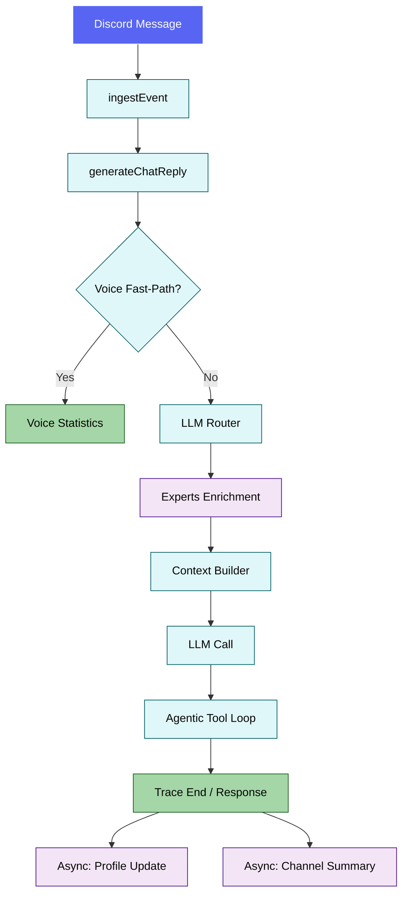

# Sage Runtime Pipeline (Routing + Orchestration)

This document explains how Sage routes incoming messages, builds context, and executes LLM calls. It reflects the current implementation in `src/core/agentRuntime` and `src/core/orchestration`.

## 1) High-level Flow

## 2) Intelligent LLM Router

**File:** `src/core/orchestration/llmRouter.ts`

Sage has moved from a regex-based router to a **High-Precision LLM Classifier** using `gemini-fast` (Gemini 2.5 Flash Lite).

- **Contextual Intelligence**: The router receives the **last 7 messages** of history, allowing it to resolve pronouns (e.g., "what about them?" or "tell me more about those sessions").
- **Classification**: It outputs a structured JSON object containing the `kind` (route), `reasoningText` (why the route was chosen), and a list of `experts` to invoke.
- **Fail-safe**: If the LLM router fails or provides invalid JSON, Sage defaults to a general conversation route (`chat`) with basic memory support.

| Route | Primary Purpose | Default Experts |
| --- | --- | --- |
| `summarize` | "summarize / recap / what happened" | Summarizer, Memory |
| `voice_analytics` | "who’s in voice / how long in voice" | VoiceAnalytics, Memory |
| `social_graph` | "relationship / social graph / who knows whom" | SocialGraph, Memory |
| `memory` | "what do you know about me" | Memory |
| `admin` | Slash command context or "admin/config" | SocialGraph, VoiceAnalytics, Memory |
| `qa` | General conversation / Default | Memory |

## 3) Narrative Experts

**File:** `src/core/orchestration/runExperts.ts`

Experts run secondary DB lookups and return **enriched narrative packets** to the LLM:

- **Memory** → Returns the user's personal profile summary.
- **Summarizer** → Returns the latest rolling channel summary.
- **VoiceAnalytics** → Returns human-readable session data (e.g., "Active for 2 hours and 15 minutes").
- **SocialGraph** → Returns relationship tiers (e.g., "Best Friend 🌟") and interaction counts.

These packets are injected into the system prompt, providing the "brain" with a high-level understanding of the context before it generates a response.

## 4) Agentic Tool Loop & Error Recovery

**File:** `src/core/agentRuntime/toolCallLoop.ts`

Sage implements a self-correcting tool loop:

1. **Execution**: The LLM calls a tool (e.g., `google_search`).
2. **Error Classification**: If the tool fails, the error is classified (e.g., `timeout`, `validation_error`).
3. **Internal Feedback**: Instead of just erroring, Sage feeds a structured "Suggestion for Agent" back to the LLM.
4. **Autonomous Retry**: The agent can choose to retry the call with corrected parameters, try a different approach, or explain the failure to the user.

### Tool Loop Sequence

```mermaid
sequenceDiagram
    participant B as LLM Brain
    participant L as Tool Loop
    participant E as Execution
    
    B->>L: Tool Call Envelope [Search: "Query"]
    L->>E: Execute with Timeout
    alt Success
        E-->>L: Results Data
        L-->>B: ✅ Succeeded: [Data]
    else Failure (Timeout/Validation)
        E-->>L: Error (e.g., Timeout)
        L->>L: Classify Error Type
        L-->>B: ❌ Failed (timeout) + 💡 Suggestion
        Note over B: Brain adjusts query/params
        B->>L: Retried Tool Call
    end
    L-->>B: Final Context
    B-->>L: Final Reply Text
```

## 5) Context Building

**File:** `src/core/agentRuntime/contextBuilder.ts`

The context builder composes a single system message with:

- Core system prompt + User/Channel profiles
- Narrative expert packets
- Relationship hints + Rolling summary
- Transcript block (respecting token budget)

It uses `contextBudgeter` to respect token limits defined in `src/config.ts`.

## 6) Tracing & Observability

**File:** `src/core/trace/agentTraceRepo.ts`

Every interaction is traced for admin debugging:

- **Reasoning**: The router's `reasoningText` is stored in the `AgentTrace` table.
- **Payloads**: expert packets, tool calls, and final responses are all logged.
- **Access**: surfaced via the `/sage admin trace` slash command.

## 7) Voice Fast-Path

Before invoking the full LLM pipeline, Sage uses a deterministic fast-path for simple voice queries (e.g., "who is in voice?"). This ensures sub-second responses for basic status checks using `src/core/voice/voiceQueries.ts`.
